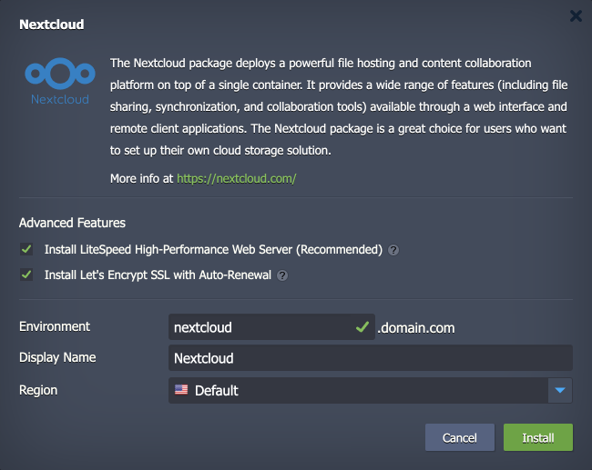
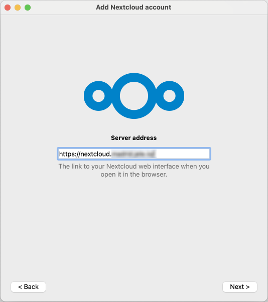
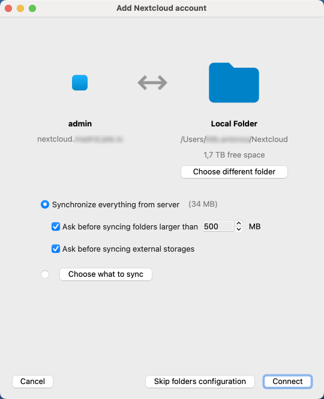
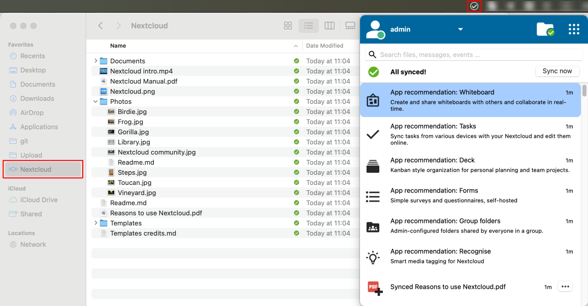

 

# Nextcloud

The package deploys the [Nextcloud](https://nextcloud.com/) solution - an open-source collaboration platform that allows users to store, share, and collaborate on files and documents securely. It provides an alternative to cloud storage services like Google Drive or Dropbox, giving users full control over their data. Nextcloud offers features such as file synchronization, sharing, versioning, and collaborative editing of documents. It also supports various integrations with third-party applications and services, making it a versatile solution for personal and business use.

## Environment Topology

This package creates a dedicated Nextcloud environment built on top of efficient single-container topology. Based on your preferences, you can choose between the **LLSMP** (Linux + LiteSpeed + MariaDB + PHP) and **LEMP** (Linux + NGINX + MariaDB + PHP) templates. Optionally, the package can automatically issue a free Let's Encrypt SSL certificate for the environment domain name (can be changed to your custom domain later). The default software stacks utilized in the package are the following:

- *LLSMP* or *LEMP*
  - LiteSpeed 6.3.2 or NGINX 1.26.3
  - PHP 8.3
  - MariaDB 10.11
  - Redis 6.2.14
- *Nextcloud* 31.0.0

## Deployment to Cloud

To get your Nextcloud solution, click the "**Deploy to Cloud**" button below, specify your email address within the widget, choose one of the [Virtuozzo Public Cloud Providers](https://www.virtuozzo.com/application-platform-partners/), and confirm by clicking **Install**.

> If you already have a Virtuozzo Application Platform (VAP) account, you can deploy this solution from the [Marketplace](https://www.virtuozzo.com/application-platform-docs/marketplace/) or [import](https://www.virtuozzo.com/application-platform-docs/environment-import/) a manifest file from this repository.

## Installation Process

In the opened installation window at the VAP dashboard, you can configure the environment settings. By default, the following two options are enabled:

- **[LiteSpeed High Performance Web Server](https://www.virtuozzo.com/application-platform-docs/litespeed-web-server/)** - installs LLSMP container based on LiteSpeed Web Server. It is a recommended option as it provides the best performance for your Nextcloud solution. If you disable this option, the LEMP container will be installed (based on the NGINX web server).
- **[Let's Encrypt SSL](https://www.virtuozzo.com/company/blog/free-ssl-certificates-with-lets-encrypt/)** - issues a free, auto-renewable SSL certificate for the environments (set a custom domain name in add-on's configurations). If you disable this option, the environment will be created with a platform's [built-in SSL](https://www.virtuozzo.com/application-platform-docs/built-in-ssl/) certificate.

Next, provide the preferred environment and display names, choose a region (if available), and confirm the installation. Your Nextcloud environment will be automatically created in a few minutes.

## Nextcloud Desktop Client

The desktop client allows you to synchronize files between your local machine and the deployed Nextcloud server. For the detailed **[Nextcloud Desktop Clients](https://docs.nextcloud.com/server/latest/user_manual/en/desktop/index.html)** guide, please refer to the linked documentation.

> **Note:** The desktop client supports full synchronization and virtual files modes. In the full synchronization mode, all files are downloaded to your local machine, while in the virtual files mode, only the metadata of the files is stored locally, and the actual files are downloaded on demand. You can switch between these modes in the client settings. However, for MacOS a separate installer is required for each mode.

1\. Download the client for your operating system from the official [Nextcloud website](https://nextcloud.com/install/#install-clients) and install it on your local machine. For this example, we will use the MacOS client with full synchronization.

> **Tip:** Alternatively, you can connect to your Nextcloud server without installing the client by [using the WebDAV protocol](https://docs.nextcloud.com/server/19/user_manual/files/access_webdav.html). For example, open **Finder** on MacOS, click on "Go" in the menu bar, select "Connect to Server," and enter the WebDAV URL of your Nextcloud server in the following format: `https://<your-nextcloud-server>/remote.php/dav/files/<username>/`.

2\. Run the client and log in to your Nextcloud server by providing the server URL and authenticating with your Nextcloud credentials.

3\. Choose local folder and what to sync.

Click **Connect** to start the synchronization process. Depending on the size of your files, this may take some time.

4\. Nextcloud will be automatically integrated into your Finder with the sync status icons and additional actions in context menu (open in browser, share link, etc.). Even more management options are available from the Nextcloud client in the menu bar at the top.

